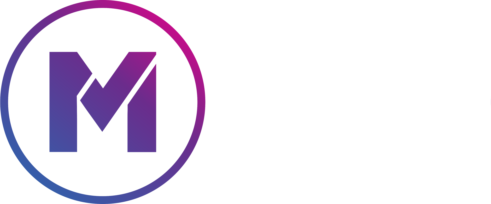

<a id="readme-top"></a>

[![Contributors][contributors-shield]][contributors-url]
[![Forks][forks-shield]][forks-url]
[![Stargazers][stars-shield]][stars-url]
[![Issues][issues-shield]][issues-url]

<!-- PROJECT LOGO -->
<br />
<div align="center">
  <a href="https://github.com/github_username/repo_name">
    
  </a>

<h3 align="center">Mission 3 - Generative AI Job Interview Practice Application </h3>

  <p align="center">
    The Job Interview Practice Application is designed to help staff members prepare for job interviews as part of a company-wide initiative to retrain employees for new roles.
    With the recent redesign of the insurance process, many staff members will be transitioning to different roles within the organization. This application provides a safe, interactive environment
    for employees to practice interview questions, develop confidence, and refine their responses.
    The app aims to simulate a realistic interview experience, offering dynamic and varied questions tailored to specific roles.
    It provides constructive feedback and actionable suggestions to help staff improve their interview performance.

<br />
<a href="https://github.com/Piro2maniC/ADV-DEV-Mission03-Frontend"><strong>Explore the docs »</strong></a>
<br />
<br />
<a href="https://github.com/Piro2maniC/ADV-DEV-Mission03-Frontend">View Demo</a>
·
<a href="https://github.com/Piro2maniC/ADV-DEV-Mission03-Frontend/issues/new?labels=bug&template=bug-report---.md">Report Bug</a>
·
<a href="https://github.com/Piro2maniC/ADV-DEV-Mission03-Frontend/issues/new?labels=enhancement&template=feature-request---.md">Request Feature</a>

  </p>
</div>

<!-- TABLE OF CONTENTS -->
<details>
  <summary>Table of Contents</summary>
  <ol>
    <li>
      <a href="#about-the-project">About The Project</a>
      <ul>
        <li><a href="#built-with">Built With</a></li>
      </ul>
    </li>
    <li>
      <a href="#getting-started">Getting Started</a>
      <ul>
        <li><a href="#prerequisites">Prerequisites</a></li>
        <li><a href="#installation">Installation</a></li>
      </ul>
    </li>
      <li><a href="#running-the-application">Running the Application</a></li>
      <li><a href="#how-to-use-the-application">How to Use the Application</a></li>  </ol>
</details>

<!-- ABOUT THE PROJECT -->

## About The Project

[![Product Name Screen Shot][product-screenshot]](https://example.com)

<p align="right">(<a href="#readme-top">back to top</a>)</p>

### Built With

- [![React][React.js]][React-url]

<p align="right">(<a href="#readme-top">back to top</a>)</p>

<!-- GETTING STARTED -->

## Getting Started

To run this Application you will need to clone both the Frontend Repository and the [Backend Repository][Backend-url].

### Prerequisites

Ensure you have the following installed on your system:

- **Node.js** (LTS version recommended)
- **npm** (comes with Node.js)
- **Git** (for cloning the repository)
- A code editor, such as **Visual Studio Code**

### Installation

1. Clone the repo
   ```sh
   git clone hhttps://github.com/Piro2maniC/ADV-DEV-Mission03-Frontend.git
   ```
2. Install NPM packages
   ```sh
   npm install
   ```
3. Change git remote url to avoid accidental pushes to base project
   ```sh
   git remote set-url origin github_username/repo_name
   git remote -v # confirm the changes
   ```

<p align="right">(<a href="#readme-top">back to top</a>)</p>

<!-- USAGE EXAMPLES -->

## Running the Application

1. Start the Frontend Development Server
   ```sh
   npm run dev
   ```
2. Hold ctrl + click on the link http://localhost:5173/

   ```sh
   VITE v5.4.10  ready in 404 ms

   ➜  Local:   http://localhost:5173/
   ➜  Network: use --host to expose
   ➜  press h + enter to show help
   ```

<p align="right">(<a href="#readme-top">back to top</a>)</p>

<!-- HOW TO USE APPLICATION -->

## How to use the Application

### 1. **Select a Role for Practice**

- **Choose a Role**: Select the role you’re preparing for from a list of available job titles.
- **Start an Interview**: Click the **Submit Response** button.

---

### 2. **Answer Interview Questions**

- **During the interview simulation:**
  - The application will present a series of **6 dynamic questions**.
  - Questions may include:
    - **Knowledge-Based**: Test your understanding of the role.
    - **Problem-Solving**: Solve a hypothetical challenge.
    - **Behavioral**: Share past experiences (e.g., teamwork, leadership).
    - **Situational**: Respond to workplace scenarios.

---

### 3. **Receive Feedback**

- After answering all questions:
  - The application provides **constructive feedback** for each response.
  - Feedback includes:
    - **Strengths** and **Areas for Improvement**.
    - **Overall Feedback** with suggestions for better answers in future interviews.

---

<p align="right">(<a href="#readme-top">back to top</a>)</p>

<!-- MARKDOWN LINKS & IMAGES -->
<!-- https://www.markdownguide.org/basic-syntax/#reference-style-links -->

[contributors-shield]: https://img.shields.io/github/contributors/Piro2maniC/ADV-DEV-Mission03-Frontend.svg?style=for-the-badge
[contributors-url]: https://github.com/Piro2maniC/ADV-DEV-Mission03-Frontend/graphs/contributors
[forks-shield]: https://img.shields.io/github/forks/Piro2maniC/ADV-DEV-Mission03-Frontend.svg?style=for-the-badge
[forks-url]: https://github.com/Piro2maniC/ADV-DEV-Mission03-Frontend/forks
[stars-shield]: https://img.shields.io/github/stars/Piro2maniC/ADV-DEV-Mission03-Frontend.svg?style=for-the-badge
[stars-url]: https://github.com/Piro2maniC/ADV-DEV-Mission03-Frontend/stargazers
[issues-shield]: https://img.shields.io/github/issues/Piro2maniC/ADV-DEV-Mission03-Frontend.svg?style=for-the-badge
[issues-url]: https://github.com/Piro2maniC/ADV-DEV-Mission03-Frontend/issues
[product-screenshot]: images/project-screenshot1.png
[React.js]: https://img.shields.io/badge/React-20232A?style=for-the-badge&logo=react&logoColor=61DAFB
[React-url]: https://reactjs.org/
[Backend-url]: https://github.com/Piro2maniC/ADV-DEV-Mission03-Backend

